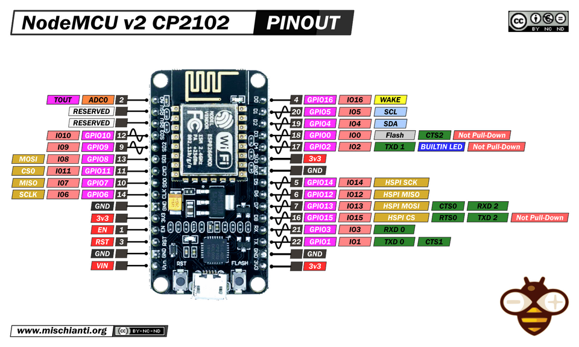
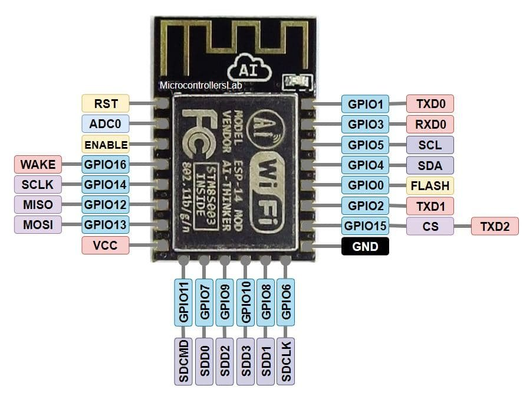

# KitchenWatch

Кухонные часы на базе **ESP8266 (NodeMCU v2)** с LED-матрицей **32×8**, часами
реального времени **DS1307**, FM-приёмником **RDA5807** и управлением через
**энкодер** и **WebSocket**.

## Возможности

- Отображение текущего времени **ЧЧ:ММ** на матрице 32×8 (4 панели WS2812B 8×8)
  с мигающим двоеточием.
- Автоматическая синхронизация DS1307 с **NTP** после подключения к Wi-Fi.
- **FM-приёмник RDA5807**: поворот энкодера ищет следующую/предыдущую станцию,
  найденная частота (например `103.9`) выводится на матрицу.
- Кнопка энкодера переключает индикацию **«часы ⇄ частота станции»**.
- Анимация подключения к Wi-Fi и индикаторы состояния:
  - зелёная точка в правом верхнем углу — Wi-Fi подключён;
  - красная точка — ошибка (RTC или приёмник не найдены).
- Управление по **WebSocket**: цвет, яркость, включение/выключение светодиодов,
  возврат в автоматический режим.

## Железо

| Компонент | Кол-во | Примечание |
|---|---|---|
| ESP8266 NodeMCU v2 | 1 | плата (`nodemcuv2`) |
| Матрица WS2812B 8×8 | 4 | разводка «змейкой», итого поле 32×8 = 256 светодиодов |
| RTC DS1307 | 1 | шина I2C |
| FM-приёмник RDA5807 | 1 | шина I2C, адреса `0x10`/`0x11` |
| Энкодер с кнопкой | 1 | например KY-040 (CLK/DT/SW) |

## Распиновка



*Распиновка NodeMCU v2. Источник: [RenzoMischianti](https://commons.wikimedia.org/wiki/File:NodeMcu_V2_CP2102_Lua_ESP8266_pinout_mischianti_high_resolution.png), лицензия [CC BY-SA 4.0](https://creativecommons.org/licenses/by-sa/4.0/).*


*Распиновка ESP8266 12E. Источник: [microcontrollerslab.com](https://microcontrollerslab.com/esp8266-pinout-reference-gpio-pins/)

| Устройство | Сигнал | Пин NodeMCU | GPIO |
|---|---|---|---|
| LED-матрица (WS2812B) | DATA | D4 | 2 |
| DS1307 | SDA | D2 | 4 |
| DS1307 | SCL | D1 | 5 |
| RDA5807 | SDA | D2 | 4 |
| RDA5807 | SCL | D1 | 5 |
| Энкодер | CLK (A) | D6 | 12 |
| Энкодер | DT (B) | D7 | 13 |
| Энкодер | SW (кнопка) | D5 | 14 |

Питание светодиодной матрицы подавайте на **5V** (например `VIN`) и общий **GND**
платы: матрица 32×8 может потреблять заметный ток, поэтому лучше запитать её
от внешнего источника 5 В с общим «землёй».

- **RDA5807** и **DS1307** подключены к одной шине I2C (`D2`/`D1`) — это пины
  `Wire` по умолчанию у NodeMCU.
- Кнопка энкодера работает с внутренней подтяжкой (`INPUT_PULLUP`), т.е. нажатие —
  это замыкание `SW` на `GND`.

### Свободные пины

Заняты GPIO: `2`, `4`, `5`, `12`, `13`, `14` (см. таблицу выше). Остальные выводы
NodeMCU v2 свободны:

| Пин NodeMCU | GPIO | Примечание |
|---|---|---|
| `D0` | 16 | только цифровой ввод/вывод: нет прерываний/PWM/I2C, используется для пробуждения из deep-sleep |
| `D3` | 0 | загрузочный пин — при старте должен быть `HIGH` (не замыкайте на `GND` при включении) |
| `D8` | 15 | загрузочный пин — при старте должен быть `LOW` (внутренняя подтяжка вниз) |
| `D9` | 3 (RX) | занят UART (`Serial`, 115200) — свободен как GPIO только если отказаться от лога |
| `D10` | 1 (TX) | занят UART (`Serial`, 115200) — свободен как GPIO только если отказаться от лога |
| `A0` | — (ADC0) | только аналоговый вход 0–1 В; цифровым GPIO не является |

Недоступные на NodeMCU v2: `GPIO6–11` и `GPIO9/GPIO10` — заняты внутренней
флеш-памятью и на плату не выведены.

## Как это работает

### Инициализация (`setup()`)

1. Последовательный порт — `115200` (для отладки).
2. **FastLED**: `WS2812B`, порядок цветов `GRB`, коррекция `TypicalLEDStrip`,
   яркость по умолчанию `64`.
3. **RTC DS1307**: `rtc.begin()`. Если DS1307 не идёт (потеря питания) —
   загружается время компиляции, которое затем поправляется по NTP.
4. **RDA5807**: `Wire.begin()` и проверка наличия чипа на адресах `0x10`/`0x11`.
   Если найден — `rx.setup()`, снятие mute, громкость `8`, стартовая частота
   `103.9 МГц`.
5. **Энкодер**: `enc.setType(TYPE2)` — один щелчок энкодера = один шаг.
6. **Wi-Fi**: подключение запускается асинхронно (`WiFi.begin`), анимацию в это
   время рисует `loop()`.
7. **WebSocket-сервер** на порту `81`.

### Основной цикл (`loop()`)

При каждом проходе вызывается `webSocket.loop()`. Если включён ручной режим
(`gManualMode`), дисплеем управляет пользователь через WebSocket, и автомат
состояний пропускается.

Конечный автомат:

| Состояние | Описание |
|---|---|
| `STATE_CONNECTING` | Wi-Fi ещё не подключён — показывается анимация «бегущая» точка с затухающим следом |
| `STATE_SYNCING` | Wi-Fi подключён — DS1307 синхронизируется с NTP (таймаут 15 с) |
| `STATE_RUNNING` | рабочий режим: обработка энкодера и отрисовка экрана 2 раза/с |

### Отображение

- **Часы** (`DISPLAY_TIME`): `ЧЧ:ММ` из DS1307, двоеточие мигает раз в секунду.
  Если DS1307 не найден — красная точка в левом верхнем углу.
- **Частота** (`DISPLAY_FREQ`): частота FM-станции в формате `103.9` / `87.5`
  (целая часть и десятые доли с десятичной точкой). Если RDA5807 не найден —
  красная точка в левом нижнем углу.
- Зелёная точка в правом верхнем углу горит в обоих режимах, когда Wi-Fi подключён.

## Управление энкодером

| Действие | Результат |
|---|---|
| Поворот вправо | поиск станции вверх (`seek` вверх), показ найденной частоты |
| Поворот влево | поиск станции вниз (`seek` вниз), показ найденной частоты |
| Нажатие кнопки | переключение индикации «часы ⇄ частота» |

Поиск станции — блокирующий (`rx.seek(...)`), занимает примерно 100–300 мс; на это
время обновление часов/WebSocket кратко приостанавливается.

## Протокол связи (HTTP / WebSocket)

Управление выполняется по протоколу **WebSocket** (RFC 6455) на порту **81**.
Соединение устанавливается обычным HTTP-запросом с заголовком
`Upgrade: websocket` (HTTP Upgrade), поэтому для работы нужен WebSocket-клиент,
а не «простой» HTTP `GET`/`POST`. Дальнейший обмен идёт текстовыми
JSON-сообщениями.

- URL подключения: `ws://<IP-адрес устройства>:81` — IP печатается в логе
  (`[WiFi] connected, IP: ...`).
- Сразу после подключения сервер отправляет `{"status":"connected"}`.
- Команды передаются текстовыми кадрами как JSON.
- Подтверждения/ответы на команды сервер **не отправляет** — результат виден на
  матрице, подробности пишутся в Serial-лог (`115200`).

### Команды

| Команда | Формат | Поля | Действие |
|---|---|---|---|
| `color` | `{"cmd":"color","r":255,"g":120,"b":0}` | `r`, `g`, `b` — 0–255 | залить всю матрицу цветом и перейти в ручной режим |
| `brightness` | `{"cmd":"brightness","value":128}` | `value` — 0–255 | установить яркость (режим индикации не меняет) |
| `on` | `{"cmd":"on"}` | — | ручной режим, включить текущим цветом |
| `off` | `{"cmd":"off"}` | — | ручной режим, выключить все светодиоды |
| `auto` | `{"cmd":"auto"}` | — | вернуться в автоматический режим (часы/частота) |

Примечания по поведению:

- `color`, `on`, `off` переводят устройство в **ручной режим** (`gManualMode`) —
  при этом энкодер и отрисовка часов/частоты приостанавливаются.
- `brightness` ручной режим **не включает**, а только меняет яркость текущего
  изображения.
- `auto` возвращает автоматический режим и сразу перерисовывает часы/частоту.
- Неизвестная команда или некорректный JSON не дают ответа клиенту — ошибка
  пишется только в Serial.

### Примеры

**1. wscat (Node.js)**

```bash
npm install -g wscat
wscat -c ws://192.168.1.50:81
# далее вводить команды построчно:
{"cmd":"color","r":255,"g":120,"b":0}
{"cmd":"brightness","value":128}
{"cmd":"auto"}
```

**2. JavaScript в браузере**

```js
const ws = new WebSocket('ws://192.168.1.50:81');

ws.onopen = () => {
    ws.send(JSON.stringify({ cmd: 'color', r: 255, g: 120, b: 0 }));
};
ws.onmessage = (e) => console.log('Ответ:', e.data); // {"status":"connected"}
```

**3. Python (websocket-client)**

```bash
pip install websocket-client
```

```python
import json
import websocket

ws = websocket.create_connection("ws://192.168.1.50:81")
print(ws.recv())                                   # {"status":"connected"}

ws.send(json.dumps({"cmd": "color", "r": 255, "g": 120, "b": 0}))
ws.send(json.dumps({"cmd": "brightness", "value": 128}))
ws.send(json.dumps({"cmd": "auto"}))

ws.close()
```

> Проверить управление «на лету» через обычный `curl` или адресную строку
> браузера нельзя: `curl` выполняет HTTP-запрос без WebSocket-обмена.
> Используйте любой из клиентов выше.

## Сборка и прошивка

Проект собирается через **PlatformIO** (среда `nodemcuv2`).

```powershell
pio run              # сборка
pio run -t upload    # прошивка по USB
pio device monitor   # просмотр лога (115200)
```

Зависимости (`platformio.ini`):

- `bblanchon/ArduinoJson`
- `links2004/WebSockets`
- `fastled/FastLED`
- `adafruit/RTClib`
- `pu2clr/PU2CLR RDA5807`
- `gyverlibs/GyverEncoder`

## Настройка

Основные параметры задаются в начале `src/main.cpp`:

| Параметр | Описание |
|---|---|
| `WIFI_SSID`, `WIFI_PASSWORD` | учётные данные Wi-Fi сети |
| `GMT_OFFSET_SEC` | часовой пояс (по умолчанию UTC+3 = Москва, без DST) |
| `NTP_SERVER_1`, `NTP_SERVER_2` | NTP-серверы |
| `CLOCK_COLOR`, `CLOCK_REFRESH_MS` | цвет цифр и период перерисовки |
| `FLIP_X`, `FLIP_Y`, `REVERSE_PANEL_ORDER` | ориентация/зеркалирование матрицы |
| `kMatrixSerpentineLayout` | разводка «змейка» внутри панели (`true` для типовых матриц 8×8) |
| `rx.setFrequency(10390)` | стартовая FM-станция (единицы 10 кГц, `10390` = 103.9 МГц) |
| `rx.setVolume(8)` | громкость приёмника (0–15) |

## Примечания

- Библиотека RDA5807 по умолчанию рассчитана на кварц **32.768 кГц** (стандартные
  модули RDA5807M). Для других модулей параметры меняются в `rx.setup(...)`.
- Если направление поворота энкодера «инвертировано», поменяйте местами CLK/DT или
  вызовите `enc.setDirection(REVERSE)`.
- Энкодер и кнопка обрабатываются только в автоматическом режиме; в ручном режиме
  (управление цветом по WebSocket) они не активны.

## Энергопотребление

Питание прибора — **5 В** (USB или `VIN`). Основной потребитель — светодиодная
матрица (256 × WS2812B); вся остальная электроника потребляет на порядки меньше.
Значения ниже — оценка по даташитам, реальные цифры зависят от яркости, цвета и
числа включённых светодиодов.

### Потребление компонентов

| Компонент | Типовой ток | Примечание |
|---|---|---|
| ESP8266 (NodeMCU) | ~70–80 мА | Wi-Fi активен; пики до ~170–200 мА при передаче |
| WS2812B, 1 светодиод | до ~60 мА | белый цвет, полная яркость (255), ~20 мА на канал RGB |
| WS2812B, 1 светодиод (выкл.) | ~0,5–1 мА | ток покоя чипа даже при погашенном светодиоде |
| RTC DS1307 | ~1,5 мА | работает постоянно от 5 В |
| FM-приёмник RDA5807 | ~20 мА | включён постоянно (mute снят, громкость 8) |
| Энкодер KY-040 | <1 мА | внутренние подтяжки GPIO |

Ток светодиода почти линейно зависит от яркости FastLED (0–255). При яркости по
умолчанию `64` (~25%) белый светодиод потребляет ~15 мА вместо ~60 мА.

### Сценарии (оценка, питание 5 В)

| Режим | Ток (примерно) | Мощность | Комментарий |
|---|---|---|---|
| `off` (матрица погашена) | ~0,4 А | ~2 Вт | 256 × ~1 мА покоя + ESP8266/RTC/радио |
| Часы / частота (типовой) | ~1,3 А | ~6,5 Вт | ~80 белых светодиодов при яркости 64 |
| Заливка всей матрицы (яркость 64) | ~4 А | ~20 Вт | все 256 светодиодов белым |
| Теоретический максимум | ~15 А | ~77 Вт | 256 белых при яркости 255 — недопустимо без мощного БП |

### Рекомендации

- Матрицу запитывайте от **внешнего источника 5 В** с общим `GND`, а не от пина
  `3.3V` NodeMCU — бортовой стабилизатор не рассчитан на ток светодиодов.
- Для режима часов достаточно БП **5 В / 2 А**; для сплошной заливки на высокой
  яркости берите запас — **5 В / 4–5 А** и более.
- Полную яркость (`brightness` 255) на всей матрице использовать не рекомендуется:
  суммарный ток превысит возможности дорожек и разъёмов.
- Снизить потребление можно уменьшением яркости, использованием одного канала
  (например, красного) вместо белого, а также отключением приёмника/радио.
- Текущая прошивка не использует режимы сна (`deepSleep`, энергосбережение Wi-Fi):
  часы, Wi-Fi и радио работают постоянно. При питании от батареи это первое место
  для оптимизации.


